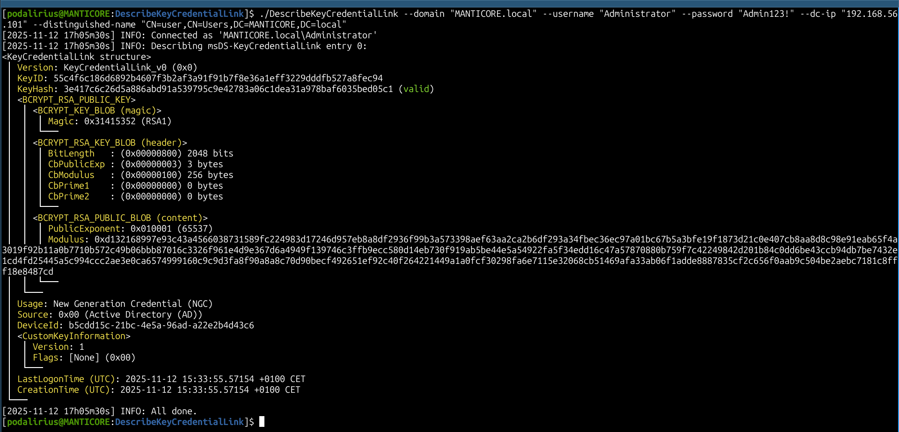
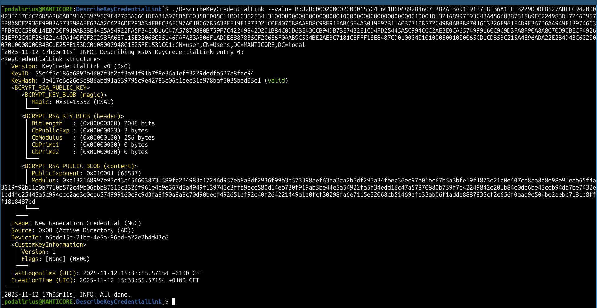

<p align="center">
      A cross-platform tool to parse and describe the contents of a raw msDS-KeyCredentialLink data blob. 
      <br>
      <a href="https://github.com/TheManticoreProject/DescribeKeyCredentialLink/actions/workflows/release.yaml" title="Build"></a>
      
       
      <br>
</p>

## Features

- [x] Read msDS-KeyCredentialLink data blob:
  - [x] from LDAP
  - [x] from a file
  - [x] from raw string

## Usage

```
$ ./DescribeKeyCredentialLink -h
DescribeKeyCredentialLink - by Remi GASCOU (Podalirius) @ TheManticoreProject - v1.3.0

Usage: DescribeKeyCredentialLink [--quiet] [--debug] [--domain <string>] --username <string> [--password <string>] [--hashes <string>] [--dc-ip <string>] [--ldap-port <tcp port>] [--use-ldaps] [--distinguished-name <string>] [--value <string>]

  -q, --quiet     Show no information at all. (default: false)
  -d, --debug     Debug mode. (default: false)

  Authentication:
    -d, --domain <string>   Active Directory domain to authenticate to. (default: "")
    -u, --username <string> User to authenticate as.
    -p, --password <string> Password to authenticate with. (default: "")
    -H, --hashes <string>   NT/LM hashes, format is LMhash:NThash. (default: "")

  LDAP Connection Settings:
    -dc, --dc-ip <string>       IP Address of the domain controller or KDC (Key Distribution Center) for Kerberos. If omitted, it will use the domain part (FQDN) specified in the identity parameter. (default: "")
    -lp, --ldap-port <tcp port> Port number to connect to LDAP server. (default: 389)
    -L, --use-ldaps             Use LDAPS instead of LDAP. (default: false)

  Source Values:
    -D, --distinguished-name <string> Distinguished Name. (default: "")
    -v, --value <string>              Raw string value of of msDS-KeyCredentialLink, it typically starts with 'B:'. (default: "")
```

## Demonstration with a `--distinguished-name` in the LDAP

```bash
./DescribeKeyCredentialLink --domain "MANTICORE.local" --username "Administrator" --password "Admin123!" --dc-ip "192.168.56.101" --debug --distinguished-name "CN=DC01,CN=Computers,DC=MANTICORE,DC=local"
```



## Demonstration with a `--value`

```bash
./DescribeKeyCredentialLink --debug --value "B:828:0002000020000108E2E5700BC0E9522D434C139C15B767678284D922DF7E92BA0DD17D62407E9D200002A786DBE1C8FD5259753E75E32DE90CA2CBE04D2A2AF4DACC29DB7C6B06FE3E411B0103525341310008000003000000000100000000000000000000010001CC86F6DEB74305A202C68F94489B82C499C6F21A74D5E290869E82FFF5B5774B961251741E42D7FEC1F5EEAE52B5C759DE321491987D6586F9F3672B4E5B88EB32827480D4444D958275113832EA7B52E91E8ED414796E6AE9061BE323D3BBFACF4448FE2451DF9325393FE1189CE53E7AE6D02E7710D71EB1F16B8ACCF13EB63F34834021DAF3398962A6C1DF4F359CE9A81BD2E6FA3D9DD095898C9FC2E2316DD10B59A5C0C09A71EA12CE70E3AC6EA42C74E258A0C13F102577B9AB2B55658A4F72CAFCDF26B0EBB124EEB3F7D97BD705D04FFA4B0D4C442F68CDC724A5DD4B42B114BB3A667A54F7A733A26F7AFC6FA09CEC688246EC32494668148C09950100040101000500100006335A9368151ACC785211B3C9DA8EC9720200070100080008A7E1A5606E06DA01080009A7E1A5606E06DA01:CN=PC12,CN=Computers,DC=LAB,DC=local"
```



## Contributing

Pull requests are welcome. Feel free to open an issue if you want to add other features.
